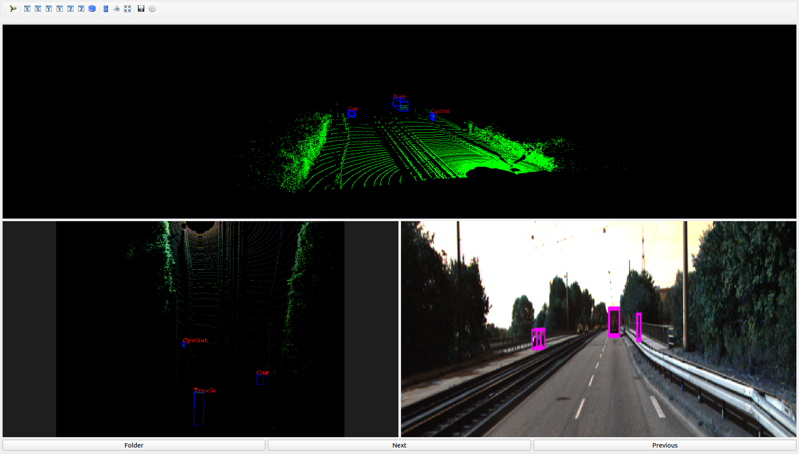

# 3D Kitti Viewer GUI

This repo provides a GUI interface to view the 3dPoint cloud, Birds eye view and camera images along with their corresponding annotation for the kitti dataset

# Installation
1. Clone the repository
2. pip3 install -r requirements.txt

# Usage
1. To launch the app, use python to run the viewer.py.
2. Click Next or previous to toggle between datasets.

# For custom datasets
1. Maintain the following folder structure
	''' plain
	.
	├── calib
	├── image_2
	├── label_2
	├── velodyne
	└── list.txt
	'''
2. Choose the corresponding parent folder

#### Viewer Sample

